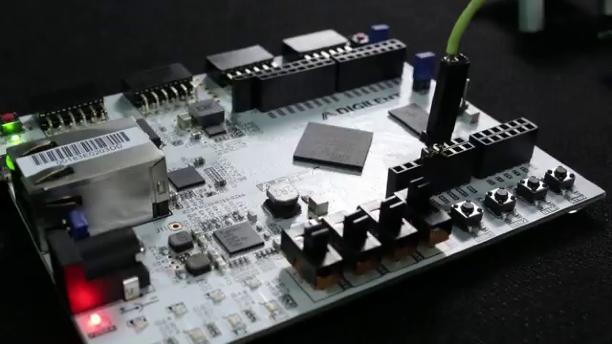
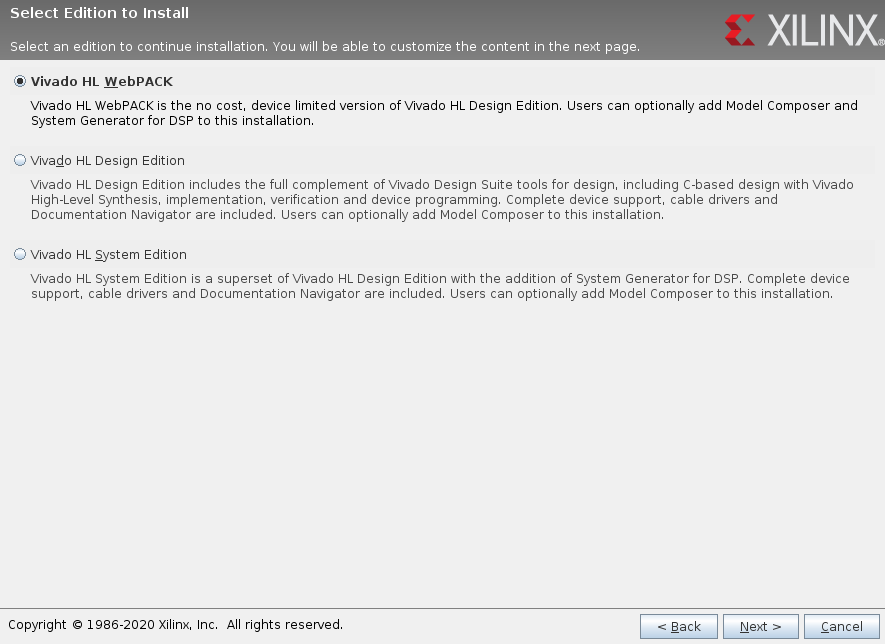
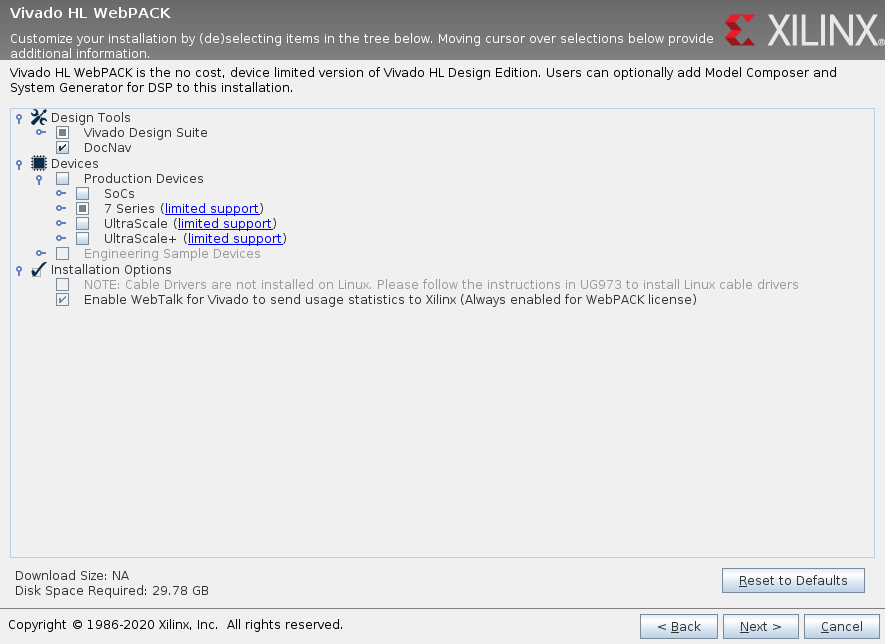
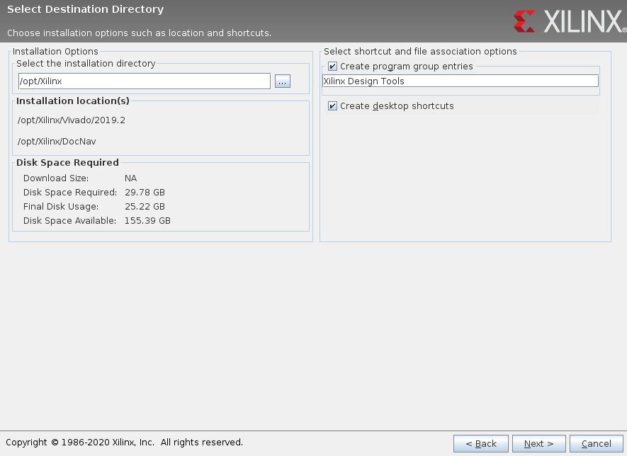
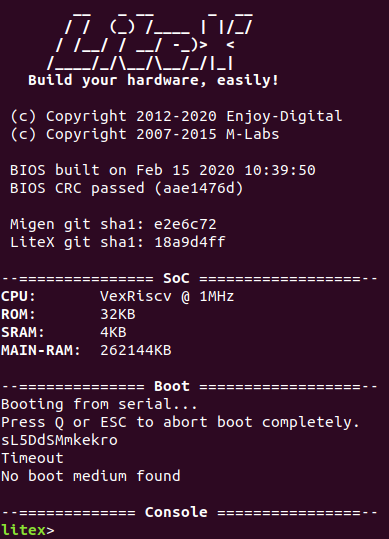

# Getting started
This page provides installation instructions for the [LiteX](https://github.com/enjoy-digital/litex) build system on Linux. This tutorial is intended for Xilinx FPGA users. 

- [Getting started](#getting-started)
  - [Arty A7](#arty-a7)
  - [Xilinx Vivado](#xilinx-vivado)
    - [Installation](#installation)
    - [Running](#running)
  - [LiteX](#litex)
    - [Setup](#setup)
    - [Building](#building)
    - [Debugging](#debugging)

## Arty A7
This project targets the [Arty A7](https://store.digilentinc.com/arty-a7-artix-7-fpga-development-board/) development board, which houses a Xilinx 7-series FPGA. The smaller variant (A35T) is sufficient, and can be purchased from electronic suppliers like Digikey and Mouser for about €110. Both the software and gateware on this device can be programmed via USB.



## Xilinx Vivado
Vivado is a commercial design and synthesis tool. The LiteX build system uses this sofrware as a backend to generate bitstreams for Xilinx FPGAs. This section is a summary of [this Wiki](https://github.com/timvideos/litex-buildenv/wiki/Xilinx-Vivado). Please reference that page if problems occur.

### Installation
1. Create an installation directory with:
```
sudo mkdir /opt/Xilinx
sudo chown $USER:$USER /opt/Xilinx
```
2. Create a Xilinx account [here](https://www.xilinx.com/registration/create-account.html).
3. Download a Linux self-extracting installer for Vivado [here](https://www.xilinx.com/support/download.html). This tutorial is based on version 2018.2, but newer versions may also work.
4. Unpack the installer with `tar -xvf`, run `chmod +x` on the extracted `.bin` file and start the installer.
5. Customize the installation according to the screenshots shown below.





### Running
It should now be possible to run Vivado from the command line. First, run `source /opt/Xilinx/Vivado/2018.2/settings64.sh` (substituting your Vivado version), then run `vivado`. Consider adding the first command to your `~/.bashrc`, as it is required by the LiteX build system after every new login. The Vivado GUI itself is rarely, if ever, needed when working with LiteX.
   
## LiteX
[LiteX](https://github.com/enjoy-digital/litex) is an open-source Python-based SoC builder. A thorough description and getting started guide is available in that project's own repository.

### Setup
We recommend following the [quick start guide](https://github.com/enjoy-digital/litex#quick-start-guide) in the LiteX README. The LiteX setup script will clone several repositories to the current directory, so it is best to start with a containing folder (e.g., `mkdir ~/litex`). After completing the instructions, the `~/litex` directory should then contain several repositories beginning with `lite*`, which are SoC peripherals, and `pythondata-cpu-*`, which contain third-party RTL source code. Test the installation with `lxsim --cpu-type=vexriscv`. This should run the LiteX emulator and bring up a BIOS prompt. 



### Building
Navigate to `~/litex/litex-boards/litex_boards/targets`. This directory contains several Python scripts for building LiteX SoCs on different FPGAs. Run `./arty.py --help` for a complete list of build options for the Arty A7. With the FPGA connected to the host computer, run `./arty --build --load` to build and load a design with default settings. (This will take several minutes.) This method does not overwrite NVRAM, so the design will not persist after reset. A synthesis report with hardware utilization statistics will be saved to `build/arty/gateware`.

### Debugging
It's possible to debug software running on the SoC via USB or Ethernet using [wishbone-tool](https://wishbone-utils.readthedocs.io/en/latest/wishbone-tool/). Debug support must be enabled in LiteX for this to work.