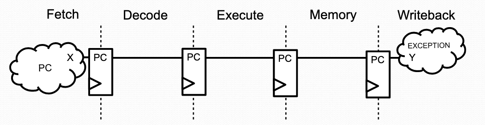
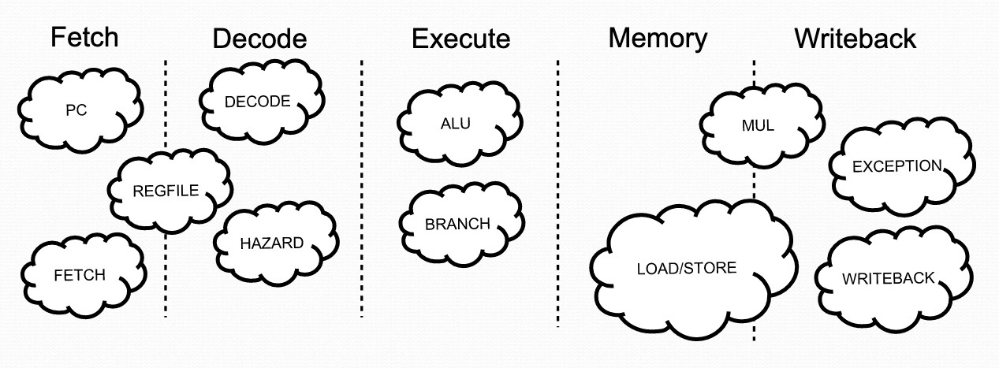
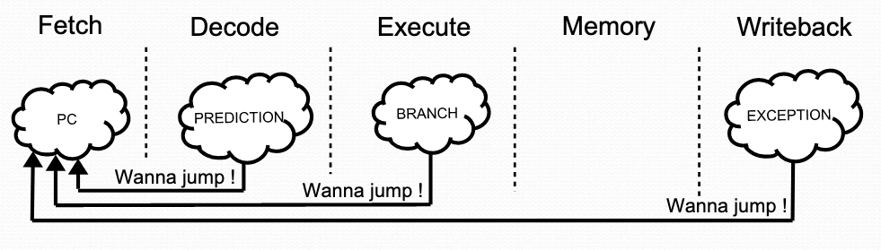

# VexRiscv introduction
[VexRiscv](https://github.com/SpinalHDL/VexRiscv) is an open-source RISC-V processor written in [SpinalHDL](https://github.com/SpinalHDL/SpinalHDL). It was awarded first place in the RISC-V Foundation's [SoftCPU contest](https://riscv.org/blog/2018/12/risc-v-softcpu-contest-highlights/) in 2018 for achieving the highest performance on both Lattice and Microsemi FPGAs. It can be scaled to fit a wide range of use cases, from highly constrained bare-metal embedded applications to multi-core Linux with the same code base.

VexRiscv takes a uniquely software-inspired approach to hardware description. Virtually every component is a __plugin__ object connected to one or more stages in the pipeline. Plugins can insert data into the pipeline at one stage, and VexRiscv will automatically propagate those signals through down the pipeline to be accessed by later stages. Plugins can also provide __services__, which are essentially APIs for other plugins to interact with. The result is a highly configurable CPU where everything down to the register file is interchangeable.

- [VexRiscv introduction](#vexriscv-introduction)
  - [SpinalHDL](#spinalhdl)
    - [Supplementary materials](#supplementary-materials)
    - [Suggestions](#suggestions)
  - [CPU pipeline](#cpu-pipeline)
    - [Plugins](#plugins)
    - [Side effects](#side-effects)
    - [Repository structure](#repository-structure)

## SpinalHDL
SpinalHDL is a Scala-based hardware description language. Traditional HDLs offer few high-level abstractions, which leads to long and repetitive descriptions of wiring interconnects. Developing complex hardware in those languages is very time consuming, and maintenence can be difficult. SpinalHDL allows developers to leverage high-level abstractions, as well as object-oriented and functional programming patterns, to create concise self-documenting hardware.

A frequently asked question regarding SpinalHDL is __how does it compare to Chisel__? The language was inspired by, though not quite "forked" from, Chisel 2. The Chisel ecosystem exists to support ASIC design and manufacturing. At the time of this writing, it's under active development with frequent API changes. SpinalHDL targets FPGAs, and is essentially "frozen" at this point. It is still actively maintained (i.e., bugs are fixed quickly and new features are added on occasion), but the API is fixed for the foreseeable future.

### Supplementary materials
An overview of the language with illustrations is available [here](https://cdn.jsdelivr.net/gh/SpinalHDL/SpinalDoc@master/presentation/en/presentation.pdf). A great starting point for learning is the [workshop](https://github.com/SpinalHDL/SpinalWorkshop), and the [docs](https://spinalhdl.github.io/SpinalDoc-RTD) are thorough and up-to-date.

### Suggestions
- Start with the workshop and inspect the Verilog output for each task. It is important to have an intuition for how SpinalHDL translates to hardware when working with larger projects.
- Use [GTKWave](http://gtkwave.sourceforge.net/) to inspect test traces in the workshop. This is an incredibly useful tool for debugging more complex hardware.
- Always be aware of what is pure Scala and what is part of the SpinalHDL libraries. It is sometimes desirable to specify a component and then duplicate or connect it with functional programming techniques. This can lead to unexpected results for the inexperienced user.
- You do __not__ need to install SpinalHDL from source to work with VexRiscv. The Scala package manager will handle this automatically when building the CPU.

## CPU pipeline
VexRiscv has a canonincal 5-stage RISC pipeline. In piplelined CPUs, the control signals are propagated through the stages through dedicated register files. For example, if the program counter (PC) signal at the __fetch__ stage is `0xabcd` on some cycle, then the the PC will be `0xabcd` when accessed by the __writeback__ stage four cycles later (assuming no jumps or stalls occur).



(Images taken from [this](https://cdn.jsdelivr.net/gh/SpinalHDL/SpinalDoc@master/presentation/en/motivation.pdf) SpinalHDL presentation.)

VexRiscv provides a convenient API for adding new signals of any data type to the CPU pipeline. This is, arguably, its greatest selling point. For example, the global declaration of PC is one line of code in the [top-level CPU definition](https://github.com/SpinalHDL/VexRiscv/blob/master/src/main/scala/vexriscv/VexRiscv.scala):
```
object PC extends Stageable(UInt(32 bits))
```
In the above illustration, the PC is given a value in the __fetch__ stage by one plugin with `fetch.insert(PC) := X`. Another plugin needs to check the PC in the __writeback__ stage, which is done with `Y := writeback.input(PC)`. VexRiscv maintains internal consistency on its own; developers typically do not need to worry about how signals are propagated.

### Plugins
The top-level CPU definition only declares which stages are present and some default `Stageable` objects. The remaining functionality consists almost entirely of `Plugin`s (see below). `Plugin`s can connect to one or more CPU stages. They interact with each other by reading and inserting `Stageable` objects, providing a __service__ API or by influencing the CPU arbitration. For example, a plugin can halt the pipeline at any stage and flush any instruction. 



VexRiscv includes two simple examples of custom plugins as a reference, available [here](https://github.com/SpinalHDL/VexRiscv/blob/master/src/main/scala/vexriscv/demo/CustomCsrDemoPlugin.scala). These are a good starting point for new developers. More advanced developers can also implement there own instructions. An example of that is provided [here](https://github.com/SpinalHDL/VexRiscv/blob/master/src/main/scala/vexriscv/demo/CustomInstruction.scala).

### Side effects
Plugins that interact with memory or modify the CPU's arbitration (such as PMP) must take into account side effects. This is relevant to more advanced developers. For example, a jump may originate from the __fetch__, __decode__ or __writeback__ stages, but CSR writes occur in the __execute__ stage. This can lead to a hazard where the CSR write modifies the machine state, even though the instruction is going to be flushed. To avoid this, the `CsrPlugin` halts the __execute__ stage for two cycles before performing to allow __memory__ and __writeback__ to finish.



### Repository structure

Config files