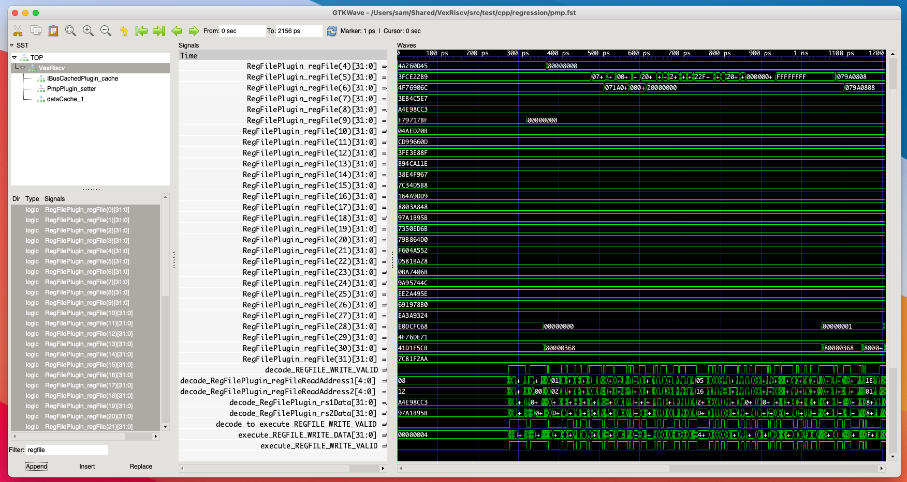

# VexRiscv testing
The VexRiscv test framework uses [Verilator](https://www.veripool.org/verilator/) to perform cycle-accurate simulations of the CPU. This is done with a mix of Scala, C++ and Assembly files. The full suite can be executed with default settings by running the command shown below. This will repeatedly generate CPU variants with random configurations and run all compatible tests.
```
sbt "testOnly vexriscv.TestIndividualFeatures"
```

- [VexRiscv testing](#vexriscv-testing)
  - [Specific feature tests](#specific-feature-tests)
    - [File structure](#file-structure)
    - [Custom tests](#custom-tests)
    - [VCD output](#vcd-output)
  - [Randomized suite](#randomized-suite)

## Specific feature tests
When developing new CPU features, it's best to follow a test-driven approach. The full randomized test suite is generally too thorough and too slow for this purpose. Instead, the developer should build a *specific* CPU configuration and run a hand-picked selection of tests. 

### File structure
The core test routine is in a 4000+ line file called `src/test/cpp/regression/main.cpp`. This defines a reference CPU model called `RiscvGolden`. Most of the tests are compared against this model to ensure correct operation. It's important to note that this C++ file must be recompiled each time the CPU source files are modified. This is because it uses the C++ header files generated by Verilator to interface directly with the emulated CPU.

The `makefile` in the same directory defines many variables, each of which corresponds to an individual test. These need to be toggled correctly in order to generate the desired subset of tests. For example, the PMP test flags are defined like so in the `makefile`.
```
PMP?=no
ifeq ($(PMP),yes)
    ADDCFLAGS += -CFLAGS -DPMP
endif
```
The first line indicates that the `PMP` variable is disabled by default. The rest of the code checks if that variable is defined as `yes`, and if so, a `PMP` variable is defined and passed to the compiler. In the `main.cpp` file, this will activate the custom PMP test:
```
#ifdef PMP
    redo(REDO,WorkspaceRegression("pmp").loadHex(string(REGRESSION_PATH) + "../raw/pmp/build/pmp.hex")->bootAt(0x80000000u)->run(10e3););
#endif
```
To run *only* the PMP test on a specific CPU configuration, we can do the following (from the repository root directory). 
```
sbt "runMain vexriscv.demo.GenSecure"
make -C src/test/cpp/regression clean run CSR_SKIP_TEST=yes CSR=yes MMU=no PMP=yes DHRYSTONE=no ISA_TEST=no
```

### Custom tests
Most of the tests included with VexRiscv come from [Coremark](https://www.eembc.org/coremark/), [Dhrystone](https://en.wikipedia.org/wiki/Dhrystone) and [riscv-formal](https://github.com/SymbioticEDA/riscv-formal). Some components have their own custom test written in Assembly, which are found in `src/test/cpp/raw`. Both the source code and the compile binaries are included in the upstream VexRiscv repository, so users do not need a RISC-V compiler toolchain to run the tests. To re-compile a specific test from source (e.g. PMP), run the following from the top-level respository directory. 
```
make -C src/test/cpp/raw/pmp
```
Test binaries are loaded onto the simulated CPU via the main test file. In the previous section, we saw that adding `PMP=yes` tells that file to include `../raw/pmp/build/pmp.hex`, for example. The custom tests report results back to the main test suite with the following *hack*:
```
fail:
    li x2, 0xf00fff24
    sw TEST_ID, 0(x2)

pass:
    li x2, 0xf00fff20
    sw x0, 0(x2)
```
Jumping to either of these labels will cause the test to conclude, because the specific addresses `0xf00fff24` and `0xf00fff20` are monitored for changes. If the result is failure, the test suite will print whatever value is stored at the former. The best way to take advantage of this is to dedicate a specific register to a test identifier, as is done in the PMP custom test:
```
test7:
    li TEST_ID, 7
    la TRAP_RETURN, fail
    li x1, 0x88fffff0
    lw x3, 0x0(x1)              // should be OK (read region 6)
    la TRAP_RETURN, test8a
    sw x3, 0x0(x1)              // should fault (write region 6)
    j fail
```
This test stores the value `7` in a register which will be written to `0xf00fff24` if the test fails where it should not. This will be reported back to the user in the test output.

In the above test segment, a dedicated register defined as `TRAP_RETURN` is used to capture exceptions and handle them appropriately. First, it is loaded with the `fail` label, because the operation `lw x3, 0x0(x1)` is *not* expected to cause an exception. If it does, the program will jump to the trap handler, and the trap handler will jump to whatever is stored in `TRAP_RETURN`. Then, it is loaded with the `test8a` label, which is the next test. This is because the `sw x3, 0x0(x1)` *is* expected to cause an exception. If does not cause an exception, the program will continue to `j fail`, failing the test. The boilerplate code for handling this is at the top of the PMP test file:
```
#define TEST_ID     x28
#define TRAP_RETURN x30
#define TRAP_EXIT   x9

.global _start
_start:
    li TRAP_EXIT, 0x0
    la x1, trap
    csrw mtvec, x1
    j test0

.global trap
trap:
    csrw mepc, TRAP_RETURN
    bnez TRAP_EXIT, trap_exit
    mret

// return from trap, but stay in M-mode
trap_exit:
    jr TRAP_RETURN
```

### VCD output
The easiest way to track down hard-to-find hardware bugs is with the waveform output. This allows you to view all signals and registers in the CPU. Simply add the flag `TRACE=yes` to the Make command in order to enable the generation of these files. They will be placed in `src/test/cpp/regression`, and can be opened with [GTKWave](http://gtkwave.sourceforge.net/).



## Randomized suite
The file `src/test/scala/vexriscv/TestIndividualFeatures.scala` contains the logic for randomly instantiating CPU configurations and running the test binaries. This is used by the continous integration system in the upstream repository for verifying new pull requests. It may be useful to run this during development to ensure that new extensions have not broken any existing features. The frequency of various test parameters are controlled by environment variables which the user can set. They are described in [this section](https://github.com/SpinalHDL/VexRiscv#regression-tests) of the VexRiscv README. Note that the randomized suite generates CPU configurations on-the-fly; it does not use any of the ones described in `src/main/scala/vexriscv/demo`. 